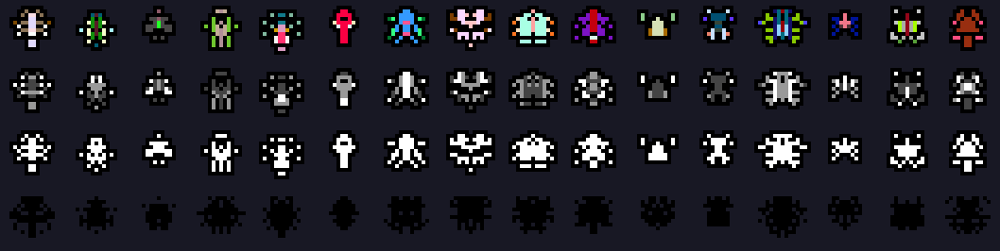
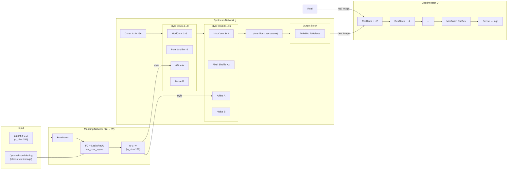
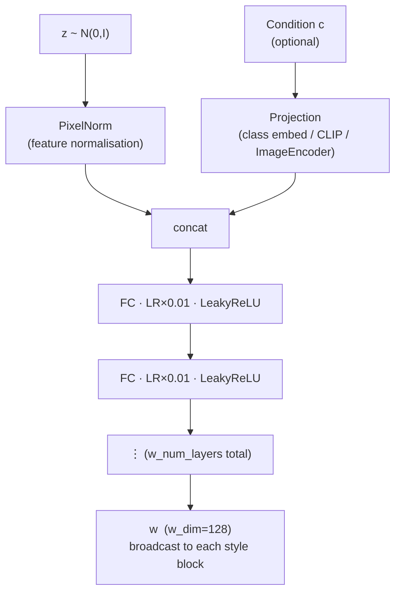
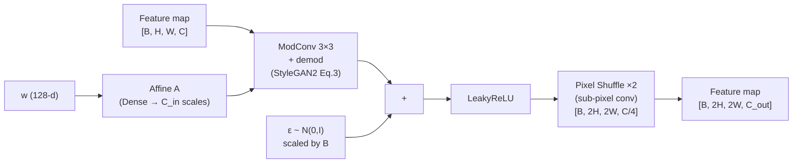
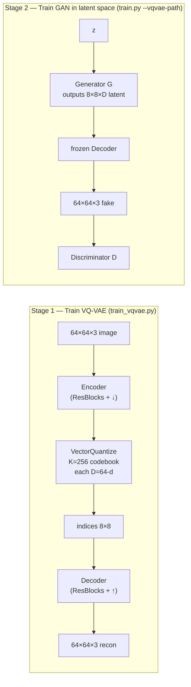
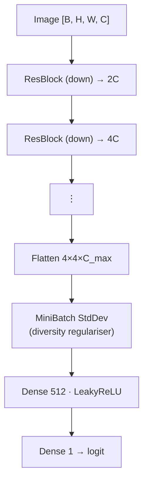

# PixelPerfectGAN

> **StyleGAN2-inspired pixel art GAN in JAX/Flax — ~25× fewer parameters, ~100× faster inference.**

Generate high-quality pixel art sprites, tiles, and icons at any retro resolution (8×8 → 256×256) using a compact GAN architecture purpose-built for pixel art — no bilinear blur, no 30M-parameter monster, no week-long training runs.

---

## Demo — ZzSprite procedural data

The dataset pipeline includes a Python port of [**ZzSprite**](https://github.com/KilledByAPixel/ZzSprite) by [Frank Force](https://github.com/KilledByAPixel), which generates endless symmetric pixel art creatures procedurally. Try the live interactable at **[killedbyapixel.github.io/ZzSprite](https://killedbyapixel.github.io/ZzSprite/)**.



*Four rows: **colored** · **grayscale** · **silhouette** · **black stencil** — each column a different seed.*

---

## Highlights

| Feature | PixelGAN | StyleGAN3 (256²) |
|---|---|---|
| Parameters (256²) | ~1.3M | ~30M |
| Inference latency (JIT) | ~1 ms | ~100 ms |
| Upsampling | Pixel shuffle (alias-free for art) | Alias-free bilinear |
| Output modes | RGB · RGBA · Palette-indexed | RGB |
| Latent space | Z → W mapping network | Z → W mapping network |
| Conditioning | Seed · Text · Image | — |
| Training framework | JAX · Flax · Optax | PyTorch |

---

## Architecture

PixelGAN is inspired by [**StyleGAN2**](https://arxiv.org/pdf/1812.04948) (Karras et al. 2020) and draws additional design ideas from [**PixelGAN**](https://github.com/Multimodal-Agents/PixelGAN). The architecture is redesigned from the ground up for pixel art constraints.

### Full pipeline



---

### Mapping network detail



---

### Style block (per resolution)

Each synthesis block processes one spatial scale. The style vector `w` modulates the convolution kernel before demodulation — identical to StyleGAN2 §3.



*Pixel shuffle replaces bilinear/bicubic upsamplers — it learns a pixel-perfect upsampling pattern with no blurring artifacts, which is exactly what pixel art requires.*

---

### VQ-VAE latent pipeline (optional)

For 64×64+ resolution, you can pre-train a VQ-VAE and then train the GAN in the 8×8 latent space — analogous to Stable Diffusion's latent diffusion trick.



---

### Discriminator



Each ResBlock:  `Conv 3×3 → LeakyReLU → Conv 3×3 ↓2 → LeakyReLU` with a `Conv 1×1 ↓2` skip connection (outputs normalised by `1/√2`).

---

### Training objectives

| Term | Formula | Purpose |
|---|---|---|
| Non-saturating G loss | $-\log \sigma(D(G(z)))$ | Generator adversarial |
| R1 gradient penalty | $\frac{\gamma}{2} \mathbb{E}_x[\|\nabla D(x)\|^2]$ | Discriminator Lipschitz stabilisation |
| Path length regularisation | $\mathbb{E}[(\\|J^T y\\| - a)^2]$ | Smooth latent walk |
| ADA augmentation | flip · rotate · colour jitter at adaptive $p$ | Small-dataset overfitting prevention |

---

## Quick-start

### 1 — Install

```bash
git clone --recurse-submodules https://github.com/Multimodal-Agents/PixelPerfectGAN.git
cd PixelGAN
pip install -r requirements.txt
```

> `--recurse-submodules` pulls [ZzSprite](https://github.com/KilledByAPixel/ZzSprite) into `vendor/ZzSprite` automatically.

> Repo: https://github.com/Multimodal-Agents/PixelPerfectGAN

### 2 — Generate a ZzSprite dataset

```bash
# 300 colored sprites at 32×32 (includes flips → ~600 images)
python scripts/generate_zzsprites.py --size 32 --n 300 --modes 0

# All four modes at 16×16
python scripts/generate_zzsprites.py --size 16 --n 400 --modes 0 1 2 3

# Preview grid only (no parquet saved)
python scripts/generate_zzsprites.py --size 16 --preview-only

# Text-captioned format (for text→image conditioning)
python scripts/generate_zzsprites.py --size 32 --dataset-mode text --n 400
```

Generated parquets land in `datasets/sprites/`. Preview sheets open at `datasets/sprites/preview_zzsprite_<size>x<size>.png`.

### 3 — Train on ZzSprites

```bash
# Unconditional colored sprites — fastest path
python scripts/train.py \
    --size 32 \
    --dataset datasets/sprites/zzsprites_seed_32x32.parquet \
    --steps 10000 --log-every 500

# With RGBA output (real alpha transparency)
python scripts/train.py \
    --size 32 --channels 4 \
    --dataset datasets/sprites/zzsprites_seed_32x32.parquet

# Text-conditioned (creature captions generated automatically)
python scripts/train.py \
    --size 32 --dataset-type text \
    --dataset datasets/sprites/zzsprites_text_32x32.parquet

# Palette-indexed output (5-colour NES palette)
python scripts/train.py \
    --size 32 --output-mode palette_indexed --palette-colors 5 \
    --dataset datasets/sprites/zzsprites_seed_32x32.parquet
```

### 4 — Inference

```bash
python scripts/inference.py \
    --checkpoint runs/pixelgan/checkpoints/latest \
    --n 16 --size 32 --output outputs/samples.png
```

---

## Project structure

```
PixelGAN/
├── src/pixelgan/
│   ├── models/
│   │   ├── generator.py        # Synthesis network + pixel shuffle blocks
│   │   ├── discriminator.py    # PatchGAN ResNet discriminator
│   │   ├── mapping_network.py  # Z → W, text/image conditioning
│   │   ├── palette_head.py     # Palette-indexed output head
│   │   └── vqvae.py            # VQ-VAE for latent-space training
│   ├── data/
│   │   ├── zzsprite_generator.py # ZzSprite Python port (this repo)
│   │   ├── sprite_generator.py   # Generic procedural sprites
│   │   └── tree_generator.py     # Procedural tree dataset
│   └── training/
│       ├── trainer.py          # Full GAN training loop (JAX JIT)
│       └── losses.py           # Non-sat loss, R1, path-length reg
├── scripts/
│   ├── train.py                # Training entry point
│   ├── train_vqvae.py          # VQ-VAE pre-training
│   ├── generate_zzsprites.py   # ZzSprite dataset generator
│   ├── generate_trees.py       # Procedural tree dataset
│   └── inference.py            # Generate images from checkpoint
├── vendor/
│   └── ZzSprite/               # ZzSprite.js submodule (Frank Force)
├── docs/assets/
│   └── zzsprite_demo.png       # Demo sprite sheet
└── requirements.txt
```

---

## ZzSprite integration

`src/pixelgan/data/zzsprite_generator.py` is a faithful Python port of [ZzSprite.js](https://github.com/KilledByAPixel/ZzSprite) by Frank Force. The XOR-shift PRNG, colour calculations, and sprite geometry are verified to match the JavaScript source exactly.

```python
from pixelgan.data.zzsprite_generator import ZzSpriteGenerator, MODE_COLORED

gen = ZzSpriteGenerator()

# Single sprite as PIL RGBA Image
img = gen.generate(seed=42, size=16, mode=MODE_COLORED)
img.save("my_sprite.png")

# Training batch (returns list of {"image_bytes", "seed", "caption"} dicts)
batch = gen.generate_batch(n=200, size=32, base_seed=0)
```

The original JavaScript interactive demo lives at **[killedbyapixel.github.io/ZzSprite](https://killedbyapixel.github.io/ZzSprite/)** — great for exploring seeds before training.

---

## Resolution presets

| Size | Era | Generator params | Blocks | Steps to convergence |
|---|---|---|---|---|
| 8×8 | NES | ~200k | 1 | ~2 000 |
| 16×16 | Game Boy | ~600k | 2 | ~5 000 |
| 32×32 | SNES | ~900k | 3 | ~10 000 |
| 64×64 | N64 | ~1.1M | 4 | ~20 000 |
| 128×128 | PS1 | ~1.2M | 5 | ~50 000 |
| 256×256 | GBA | ~1.3M | 6 | ~100 000 |

---

## Citations

If you use this project please cite:

**StyleGAN2** — the paper this architecture is derived from:
```bibtex
@inproceedings{karras2020analyzing,
  title     = {Analyzing and Improving the Image Quality of {StyleGAN}},
  author    = {Karras, Tero and Laine, Samuli and Aittala, Miikka and Hellsten, Janne
               and Lehtinen, Jaakko and Aila, Timo},
  booktitle = {Proceedings of the IEEE/CVF Conference on Computer Vision and Pattern Recognition (CVPR)},
  year      = {2020},
  url       = {https://arxiv.org/pdf/1812.04948}
}
```

**StyleGAN3** — alias-free generator design, adapted for pixel shuffle upsampling:
```bibtex
@inproceedings{karras2021alias,
  title     = {Alias-Free Generative Adversarial Networks},
  author    = {Karras, Tero and Aittala, Miikka and Laine, Samuli and H{\"a}rk{\"o}nen, Erik
               and Hellsten, Janne and Lehtinen, Jaakko and Aila, Timo},
  booktitle = {Advances in Neural Information Processing Systems (NeurIPS)},
  year      = {2021},
  url       = {https://github.com/NVlabs/stylegan3}
}
```

**PixelGAN** — multimodal pixel art generation architecture, design reference:
```bibtex
@misc{pixelgan2024,
  title  = {{PixelGAN}: Multimodal Pixel Art Generation},
  author = {Multimodal-Agents},
  year   = {2024},
  url    = {https://github.com/Multimodal-Agents/PixelGAN}
}
```

**PixelPerfectGAN** — this repository:
```bibtex
@misc{pixelperfectgan2026,
  title  = {{PixelPerfectGAN}: StyleGAN2-Inspired Pixel Art GAN in JAX/Flax},
  author = {Multimodal-Agents},
  year   = {2026},
  url    = {https://github.com/Multimodal-Agents/PixelPerfectGAN}
}
```

**ZzSprite** — procedural sprite generator used for dataset creation:
```bibtex
@misc{zzsprite,
  title  = {{ZzSprite}: Procedural Pixel Art Sprite Generator},
  author = {Frank Force},
  url    = {https://github.com/KilledByAPixel/ZzSprite},
  note   = {Interactive demo: \url{https://killedbyapixel.github.io/ZzSprite/}}
}
```

---

## Trained models

See [models/MODELS.md](models/MODELS.md) for the full model catalog.
Checkpoint files are attached to [GitHub Releases](https://github.com/Multimodal-Agents/PixelPerfectGAN/releases).

### space-monsters-1 *(training)*

Unconditional pixel art creature generator trained on ZzSprite procedural data — all 4 colour modes.

| | |
|---|---|
| Dataset | ZzSprite 32×32 (600 sprites · 4 modes · seed + text) |
| G / D params | 2.53M / 9.06M |
| Size | 32×32 RGB |
| Batch | 32 |
| G LR / D LR | 2e-4 / 2e-4 |
| R1 γ | 10.0 |

**Smoke test results (500 steps — 16 kimg):**

| Metric | Value |
|---|---|
| G loss | 4.2965 |
| D loss | 0.0984 |
| ADA p | 0.029 |
| Training speed | 0.037 kimg/s |
| JIT compile (first run) | ~4 min 28 s |
| Train wall time (500 steps) | ~2 min 33 s |

> Smoke test confirmed model builds, data loads, and JAX/GPU pipeline is solid.
> Full 10 000-step run (~90 min) is the next step.

Full training command:
```bash
python scripts/train.py \
    --size 32 \
    --dataset datasets/sprites/sprites_zzsprite_32x32.parquet \
    --output runs/space-monsters-1 \
    --steps 10000 \
    --log-every 200 \
    --sample-every 500 \
    --checkpoint-every 2000 \
    --no-prealloc
```

---

## License

MIT — see [LICENSE](LICENSE).

